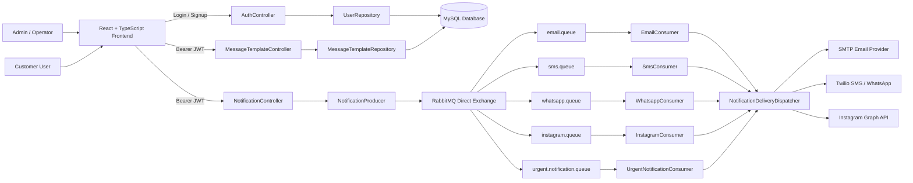
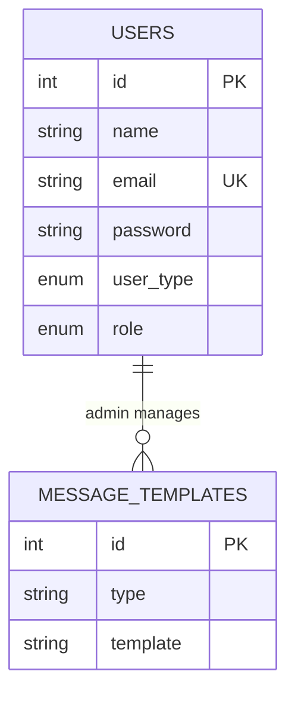
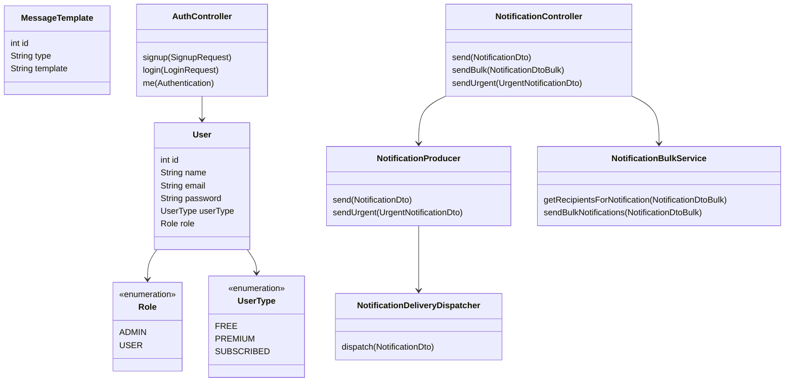
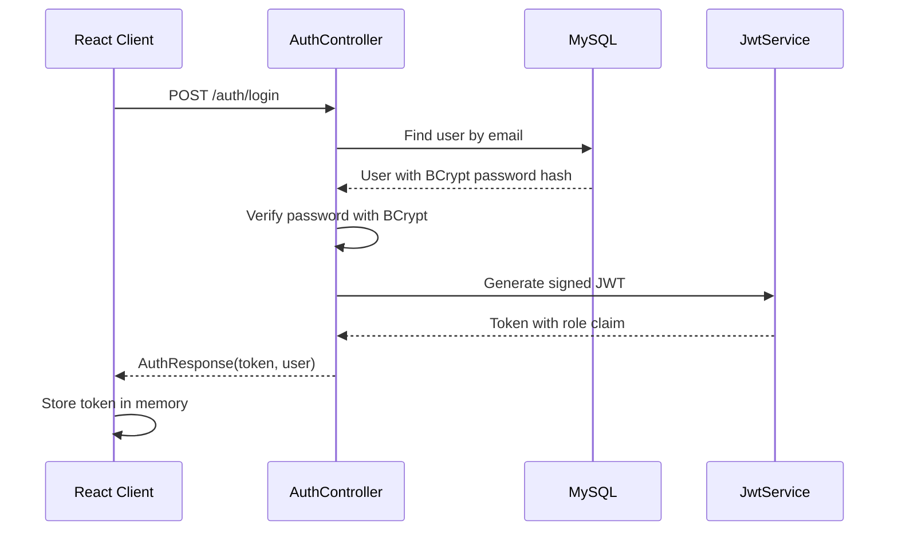
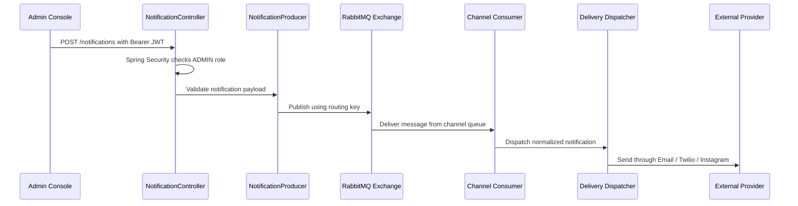

# Omni-Channel Notification Platform

A full-stack notification management system for sending secure, role-protected, asynchronous alerts across Email, SMS, WhatsApp, and Instagram-style delivery channels.

The project is designed like a real internal operations console: administrators can manage users, create templates, launch campaigns, and trigger urgent priority alerts, while customers only access their own user portal.

## Why This Project Stands Out

- Built a full-stack product using React, TypeScript, Spring Boot, MySQL, and RabbitMQ.
- Implemented JWT authentication with Spring Security and role-based authorization.
- Protected admin workflows so only `ADMIN` users can send notifications or manage templates.
- Added BCrypt password hashing instead of storing plain-text passwords.
- Designed asynchronous notification routing through RabbitMQ queues.
- Supported direct messages, urgent priority alerts, and template-based bulk campaigns.
- Integrated provider-ready delivery services for Email, Twilio SMS, WhatsApp, and Instagram.

## Tech Stack

| Layer | Technology |
| --- | --- |
| Frontend | React, TypeScript, Vite |
| Backend | Java 21, Spring Boot |
| Security | Spring Security, JWT, BCrypt |
| Database | MySQL, Spring Data JPA |
| Messaging | RabbitMQ, Spring AMQP |
| Delivery Providers | SMTP, Twilio API, Instagram Graph API-ready service |
| Build Tools | Maven, npm |

## Core Features

### Authentication and Authorization

- User signup and login.
- BCrypt password hashing.
- JWT-based stateless authentication.
- Separate `ADMIN` and `USER` roles.
- Admin-only APIs for templates and notification dispatch.

### Notification Operations

- Direct one-to-one notifications.
- Bulk campaign notifications using message templates.
- Segment-based campaign targeting using `FREE`, `PREMIUM`, and `SUBSCRIBED` users.
- Explicit recipient-list campaign support.
- Urgent notification queue with priority values from `1` to `10`.

### Admin Console

- Secure admin login.
- Message operations workspace.
- Template creation and preview.
- User account management.
- Channel-aware notification forms.

### Customer Portal

- Customer login.
- Profile and plan view.
- User-specific interface separated from admin operations.

## System Architecture



## ER Diagram



Current persistent entities are intentionally focused: users and reusable message templates. Notification payloads are routed asynchronously through RabbitMQ queues instead of being stored as database rows.

## UML Class Diagram



## Authentication Flow



## Notification Dispatch Flow



## Role-Based Access Matrix

| Capability | ADMIN | USER |
| --- | ---: | ---: |
| Login | Yes | Yes |
| View own portal | No | Yes |
| Create templates | Yes | No |
| View templates | Yes | No |
| Send direct notification | Yes | No |
| Send urgent notification | Yes | No |
| Launch bulk campaign | Yes | No |
| Manage users | Yes | No |

## API Overview

### Auth

| Method | Endpoint | Access | Description |
| --- | --- | --- | --- |
| `POST` | `/auth/signup` | Public | Create a user account |
| `POST` | `/auth/login` | Public | Login and receive JWT |
| `GET` | `/auth/me` | Authenticated | Get current authenticated user |

### Templates

| Method | Endpoint | Access | Description |
| --- | --- | --- | --- |
| `GET` | `/templates` | ADMIN | List message templates |
| `POST` | `/templates` | ADMIN | Create a message template |

### Notifications

| Method | Endpoint | Access | Description |
| --- | --- | --- | --- |
| `POST` | `/notifications` | ADMIN | Send direct notification |
| `POST` | `/notifications/bulk` | ADMIN | Launch template campaign |
| `POST` | `/notifications/urgent` | ADMIN | Queue urgent priority alert |

## Example Requests

### Login

```bash
curl -X POST http://localhost:8080/auth/login \
  -H "Content-Type: application/json" \
  -d '{
    "email": "admin@notification.local",
    "password": "admin123"
  }'
```

### Send Urgent Notification

```bash
curl -X POST http://localhost:8080/notifications/urgent \
  -H "Content-Type: application/json" \
  -H "Authorization: Bearer <JWT_TOKEN>" \
  -d '{
    "type": "sms",
    "recipient": "+919876543210",
    "message": "Rs. 500 has been deducted from your account. Ref: TXN12345",
    "eventType": "AMOUNT_DEDUCTION",
    "referenceId": "TXN12345",
    "priority": 10,
    "metadata": {
      "source": "admin-console"
    }
  }'
```

### Launch Bulk Campaign

```bash
curl -X POST http://localhost:8080/notifications/bulk \
  -H "Content-Type: application/json" \
  -H "Authorization: Bearer <JWT_TOKEN>" \
  -d '{
    "templateId": 1,
    "userType": "PREMIUM"
  }'
```

## Local Setup

### Prerequisites

- Java 21+
- Node.js 20+
- MySQL
- RabbitMQ
- Maven wrapper included in the backend folder

### Backend

```bash
cd notificationservice
./mvnw spring-boot:run
```

Default backend URL:

```text
http://localhost:8080
```

### Frontend

```bash
cd NotificationReact/notification-frontend
npm install
npm run dev
```

Default frontend URL:

```text
http://localhost:5173
```

## Environment Variables

The app supports environment-based secrets so production credentials do not need to live in source code.

| Variable | Purpose | Default |
| --- | --- | --- |
| `JWT_SECRET` | JWT signing secret | Development-only fallback |
| `JWT_EXPIRATION_SECONDS` | Token lifetime | `86400` |
| `ADMIN_EMAIL` | Seeded admin email | `admin@notification.local` |
| `ADMIN_PASSWORD` | Seeded admin password | `admin123` |
| `MAIL_HOST` | SMTP host | `sandbox.smtp.mailtrap.io` |
| `MAIL_USERNAME` | SMTP username | Empty |
| `MAIL_PASSWORD` | SMTP password | Empty |
| `TWILIO_ACCOUNT_SID` | Twilio account SID | Empty |
| `TWILIO_AUTH_TOKEN` | Twilio auth token | Empty |
| `TWILIO_SMS_FROM` | SMS sender number | Empty |
| `TWILIO_WHATSAPP_FROM` | WhatsApp sender number | Empty |

## RabbitMQ Routing

| Notification Type | Routing Key | Queue |
| --- | --- | --- |
| Email | `email.routing.key` | `email.queue` |
| SMS | `sms.routing.key` | `sms.queue` |
| WhatsApp | `whatsapp.routing.key` | `whatsapp.queue` |
| Instagram | `instagram.routing.key` | `instagram.queue` |
| Urgent | `urgent.notification.routing.key` | `urgent.notification.queue` |

## Security Highlights

- Passwords are hashed using BCrypt before storage.
- JWTs are signed with HMAC-SHA256.
- Protected routes require a valid `Authorization: Bearer <token>` header.
- Admin-only APIs use role-based authorization through Spring Security.
- Frontend no longer trusts local hardcoded admin credentials.

## Suggested Resume Bullets

- Built an omni-channel notification platform using React, TypeScript, Spring Boot, MySQL, and RabbitMQ to support direct, urgent, and bulk campaign notifications.
- Implemented JWT authentication, BCrypt password hashing, and role-based authorization with Spring Security to protect admin-only notification workflows.
- Designed asynchronous message routing using RabbitMQ direct exchanges, channel-specific queues, and priority-based urgent notification dispatch.
- Developed an admin console for template management, campaign launch, user management, and multi-channel message operations.

## Future Improvements

- Add notification history and delivery status tracking.
- Add retry logic and dead-letter queues for failed deliveries.
- Add Swagger/OpenAPI documentation.
- Add Docker Compose for one-command local setup.
- Add integration tests with Testcontainers for MySQL and RabbitMQ.
- Deploy frontend and backend with a live demo link.

